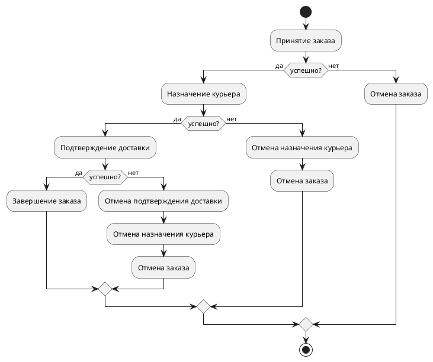

## Code Saga Diagram

```puml
@startuml
start
:Принятие заказа;
if (успешно?) then (да)
  :Назначение курьера;
  if (успешно?) then (да)
    :Подтверждение доставки;
    if (успешно?) then (да)
      :Завершение заказа;
    else (нет)
      :Отмена подтверждения доставки;
      :Отмена назначения курьера;
      :Отмена заказа;
    endif
  else (нет)
    :Отмена назначения курьера;
    :Отмена заказа;
  endif
else (нет)
  :Отмена заказа;
endif
stop
@enduml

```