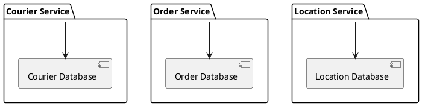

## Container Diagram

```puml
@startuml
package "Courier Service" {
  [Courier Database]
}

package "Order Service" {
  [Order Database]
}

package "Location Service" {
  [Location Database]
}

[Courier Service] --> [Courier Database]
[Order Service] --> [Order Database]
[Location Service] --> [Location Database]
@enduml
```